# Windows Server 2025 Active Directory Enterprise Homelab

## Project Overview

This project documents the design, deployment, administration, security configuration, and validation of a virtualized Windows enterprise environment built for **MakahaV Solutions**, a fictional small business.

The purpose of the lab was to move beyond studying Windows administration concepts theoretically and implement them in a functioning environment using **Windows Server 2025, Windows 11 Pro, Microsoft Hyper-V, Active Directory Domain Services, DNS, Group Policy, SMB, NTFS permissions, and PowerShell**.

The completed environment provides centralized:

- Identity management
- User authentication
- Computer management
- DNS resolution
- Organizational Unit administration
- Security-group-based authorization
- Workstation security policy
- Security auditing
- Departmental file sharing
- Least-privilege access control
- Automated network drive provisioning

A Windows 11 workstation was joined to the domain and used to validate the environment from an employee's perspective.

Both **positive and negative security tests** were performed to confirm that authorized users could access appropriate resources while unauthorized users were denied.

---

# Business Scenario

MakahaV Solutions is modeled as a small organization with three departments:

- Information Technology
- Accounting
- Sales

The organization needs centralized management rather than maintaining independent user accounts and permissions on individual computers.

The infrastructure was therefore designed around an Active Directory domain:

`ad.makahav.test`

Employees receive domain identities and are organized according to department.

Access to departmental resources is controlled through Active Directory security groups rather than permissions assigned directly to individual employees.

This produces a model such as:

```text
Employee
   |
   v
Department Security Group
   |
   v
Resource Permissions
   |
   v
Department Data
```

If an employee changes departments, access can be modified by changing group membership rather than manually editing permissions on every resource.

---

# Project Objectives

The primary objectives were to gain hands-on experience with:

- Microsoft Hyper-V
- Windows Server 2025 administration
- Windows 11 enterprise integration
- Active Directory Domain Services
- DNS
- Organizational Unit design
- Domain user administration
- Security groups
- Role-based access control
- Group Policy
- Group Policy Preferences
- Windows security auditing
- SMB file sharing
- NTFS permissions
- Least privilege
- Domain authentication
- Windows networking
- PowerShell administration
- Infrastructure troubleshooting
- Technical validation

---

# Lab Architecture

## Virtual Machines

| System | Operating System | Role | IPv4 Address |
|---|---|---|---|
| `DC01` | Windows Server 2025 | Domain Controller / DNS / File Services | `10.10.10.10` |
| `CLIENT01` | Windows 11 Pro | Domain Workstation | `10.10.10.20` |

## Domain

```text
ad.makahav.test
```

NetBIOS domain name:

```text
MAKAHAV
```

## Network

```text
10.10.10.0/24
```

The lab uses an isolated Hyper-V virtual network named:

```text
MakahaV-Lab
```

Logical architecture:

```text
                       ad.makahav.test
                              |
                             DC01
                         10.10.10.10
                              |
              +---------------+---------------+
              |                               |
       Active Directory                      DNS
              |                               |
              +---------------+---------------+
                              |
                        MakahaV-Lab
                              |
                           CLIENT01
                         10.10.10.20
                              |
                       Windows 11 Pro
                              |
                       Domain Employees
```

CLIENT01 uses DC01 as its DNS server:

```text
CLIENT01
10.10.10.20
     |
     | DNS
     v
DC01
10.10.10.10
```

This is critical because Active Directory clients use DNS to locate domain controllers and AD services.

---

# 1. Domain Controller Network Configuration

DC01 was configured with a static IPv4 address:

```text
IPv4 Address:    10.10.10.10
Subnet Mask:     255.255.255.0
DNS Server:      10.10.10.10
```

A domain controller should have a predictable network address because domain clients depend on it for services such as DNS and authentication.

DC01 also hosts the DNS service for the Active Directory environment.

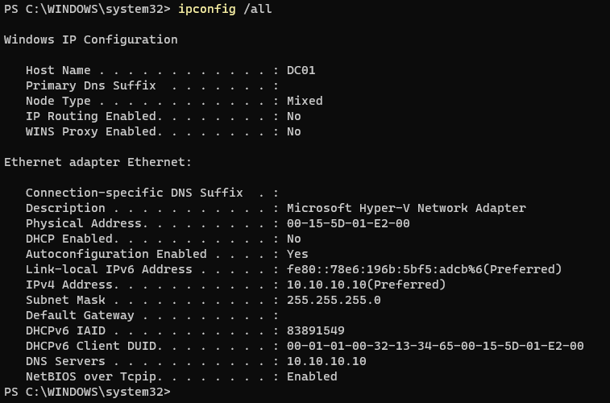

### Why this matters

Using dynamic addressing for core infrastructure could cause clients to lose access if the server address changed.

A static address ensures that:

```text
CLIENT01 -> 10.10.10.10 -> DC01
```

remains consistent.

---

# 2. Active Directory Domain Services and DNS

Active Directory Domain Services was installed on DC01 and the server was promoted to a domain controller for the new forest:

```text
ad.makahav.test
```

DNS was integrated with Active Directory.

One important validation step was confirming that DNS contained the appropriate **SRV records** used by clients to discover Active Directory services.

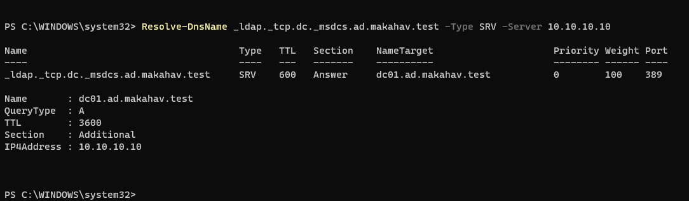

DNS resolution was also tested using PowerShell:

```powershell
Resolve-DnsName dc01.ad.makahav.test
```

and:

```powershell
Resolve-DnsName _ldap._tcp.dc._msdcs.ad.makahav.test -Type SRV
```

The expected domain controller was returned:

```text
dc01.ad.makahav.test
```

This demonstrated an important lesson from the project:

> Active Directory is heavily dependent on DNS.

A machine can have basic IP connectivity to a domain controller and still fail to discover the domain if its DNS configuration is incorrect.

---

# 3. Active Directory Organizational Unit Design

Rather than placing every object in default Active Directory containers, a custom Organizational Unit structure was created for MakahaV Solutions.

```text
ad.makahav.test
|
└── MakahaV
    |
    ├── Computers
    |
    ├── Groups
    |
    └── Users
        ├── IT
        ├── Accounting
        └── Sales
```

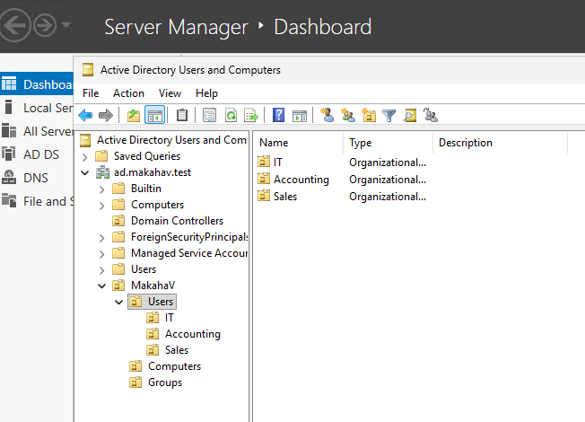

This structure separates:

- Workstations
- Security groups
- Employees
- Departments

OU design became important later when Group Policy was introduced.

For example:

```text
MakahaV
└── Computers
    └── CLIENT01
```

allowed workstation-specific policy to be applied without applying the same settings to DC01.

---

# 4. Domain User Provisioning

Eleven fictional employee accounts were created across the three business departments.

Each employee received an Active Directory domain identity rather than a local workstation account.

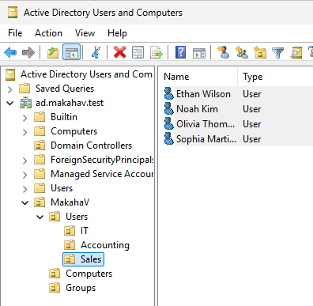

Users were placed into the appropriate departmental OU.

Example:

```text
MakahaV
└── Users
    ├── IT
    │   └── Alex Rivera
    │
    ├── Accounting
    │   └── Priya Shah
    │
    └── Sales
```

Temporary passwords were configured with:

```text
User must change password at next logon
```

This provided hands-on experience with a common enterprise onboarding workflow.

The lab also included a simulated help-desk password reset when a temporary employee password was forgotten.

The password was reset through **Active Directory Users and Computers**, after which the employee successfully authenticated from CLIENT01.

---

# 5. Security Groups and Role-Based Access

Three global security groups were created:

```text
GG_IT
GG_Accounting
GG_Sales
```

Employees were assigned to the group representing their department.

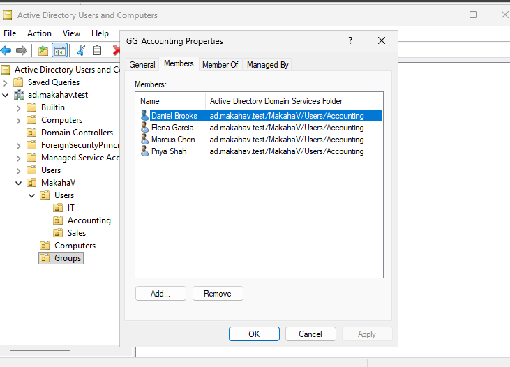

Instead of designing permissions like this:

```text
Priya -> Accounting folder
Employee 2 -> Accounting folder
Employee 3 -> Accounting folder
```

the environment uses:

```text
Accounting Employees
        |
        v
GG_Accounting
        |
        v
Accounting Resources
```

This makes access easier to administer and demonstrates the principle of **role-based access control**.

Permissions are assigned to the role/group, while users receive access through membership in that role.

---

# 6. Windows 11 Client Deployment

A Generation 2 Hyper-V virtual machine named:

```text
CLIENT01
```

was created and Windows 11 Pro was installed.

CLIENT01 was configured with:

```text
IPv4 Address:    10.10.10.20
Subnet Mask:     255.255.255.0
DNS Server:      10.10.10.10
```

Basic connectivity to DC01 was verified before attempting the domain join:

```powershell
ping 10.10.10.10
```

DNS discovery was then verified.

Only after both IP connectivity and DNS discovery succeeded was CLIENT01 joined to:

```text
ad.makahav.test
```

The domain join produced:

```text
Welcome to the ad.makahav.test domain
```

CLIENT01's computer object was then moved from the default Computers container into:

```text
MakahaV
└── Computers
    └── CLIENT01
```

This allowed workstation Group Policy to be scoped specifically to the custom Computers OU.

---

# 7. Domain User Authentication

After CLIENT01 joined the domain, a MakahaV employee account was used to authenticate to the workstation.

The session was verified using:

```powershell
whoami
```

and:

```powershell
hostname
```

The results were:

```text
makahav\arivera
CLIENT01
```

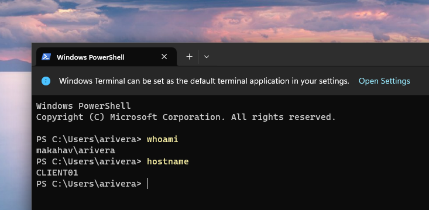

This demonstrates two separate identities working together:

```text
Computer:
CLIENT01

Authenticated user:
MAKAHAV\arivera
```

The employee identity exists centrally in Active Directory rather than in CLIENT01's local account database.

---

# 8. Group Policy Workstation Security Baseline

A custom Group Policy Object was created:

```text
MakahaV - Workstation Security Baseline
```

The GPO was linked specifically to:

```text
MakahaV
└── Computers
```

rather than modifying the Default Domain Policy.

This keeps workstation configuration logically separated from domain-wide policy.

## Machine Inactivity Limit

The policy:

```text
Interactive logon: Machine inactivity limit
```

was configured to:

```text
600 seconds
```

or:

```text
10 minutes
```

This reduces the risk of an authenticated workstation remaining indefinitely accessible if an employee walks away without manually locking it.

CLIENT01 refreshed policy using:

```powershell
gpupdate /force
```

Policy application was verified with:

```powershell
gpresult /r /scope computer
```

The result showed:

```text
MakahaV - Workstation Security Baseline
```

under the applied Group Policy Objects.

The actual resulting configuration was independently verified using:

```powershell
reg query "HKLM\SOFTWARE\Microsoft\Windows\CurrentVersion\Policies\System" /v InactivityTimeoutSecs
```

Result:

```text
InactivityTimeoutSecs    REG_DWORD    0x258
```

`0x258` hexadecimal equals:

```text
600 decimal
```

which confirms the configured 10-minute inactivity policy.

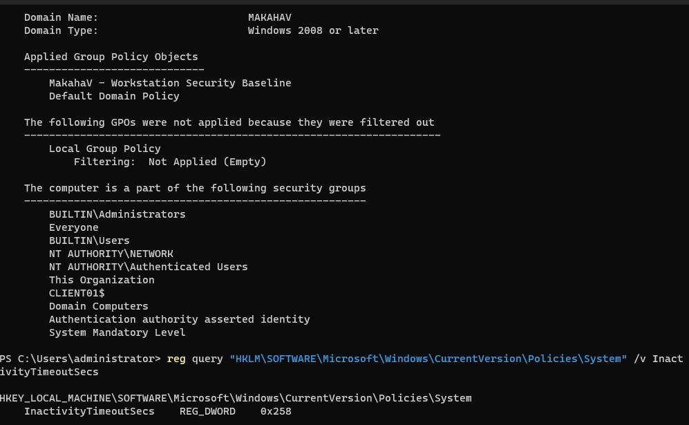

This verification process demonstrated an important administrative principle:

> Do not assume a policy worked simply because it was configured on the server. Verify the resulting state on the endpoint.

---

# 9. Windows Security Auditing

The workstation security baseline was later expanded to include logon auditing.

Under Advanced Audit Policy Configuration:

```text
Audit Logon
```

was configured for:

```text
Success
Failure
```

CLIENT01 refreshed the policy and the resulting configuration was verified using:

```powershell
auditpol /get /subcategory:"Logon"
```

Result:

```text
Logon    Success and Failure
```

This provides visibility into successful and unsuccessful authentication activity on the workstation.

---

# 10. Departmental File Services

DC01 was configured to provide departmental SMB file shares.

The following directories were created:

```text
C:\Shares
├── Accounting
├── IT
└── Sales
```

They were published as:

```text
\\DC01\Accounting
\\DC01\IT
\\DC01\Sales
```

Access was assigned using the departmental security groups.

| Resource | Authorized Group |
|---|---|
| Accounting | `GG_Accounting` |
| IT | `GG_IT` |
| Sales | `GG_Sales` |

---

# 11. Share Permissions and NTFS Permissions

Both SMB share permissions and NTFS filesystem permissions were configured.

## Share Permissions

Each departmental group received:

```text
Read
Change
```

Full Control was not granted to normal departmental users.

## NTFS Permissions

Inheritance was disabled on each departmental folder by converting inherited permissions into explicit permissions.

Administrative and system entries were retained:

```text
Administrators
SYSTEM
CREATOR OWNER
```

Generic Users entries were removed.

The appropriate departmental security group was then granted:

```text
Modify
```

applying to:

```text
This folder, subfolders and files
```

The resulting access path is:

```text
Employee
   |
   v
Department Security Group
   |
   v
SMB Share Permission
   |
   v
NTFS Permission
   |
   v
Department Files
```

This provides multiple layers of authorization.

---

# 12. Least-Privilege Negative Test

Configuring permissions is only part of the job.

The controls were deliberately tested using an employee who **should not** have access.

Alex Rivera authenticated to CLIENT01 as:

```text
MAKAHAV\arivera
```

Alex belongs to:

```text
GG_IT
```

He then attempted to access:

```text
\\DC01\Accounting
```

Windows denied the request.

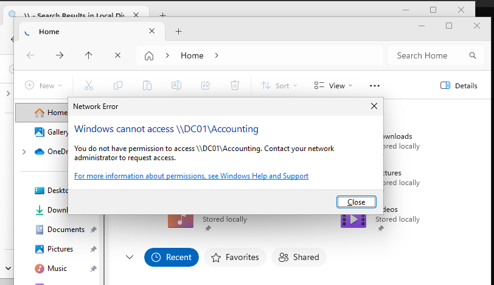

This was the expected security result:

```text
MAKAHAV\arivera
        |
        v
      GG_IT
        |
        X
        |
GG_Accounting required
        |
        v
\\DC01\Accounting

ACCESS DENIED
```

This test was important because it demonstrated that an authenticated domain user does **not** automatically receive access to unrelated business resources.

---

# 13. Least-Privilege Positive Test

The same resource was then tested using an authorized Accounting employee.

Priya Shah authenticated as:

```text
MAKAHAV\pshah
```

Her identity was verified with:

```powershell
whoami
```

Priya is a member of:

```text
GG_Accounting
```

She then accessed:

```text
\\DC01\Accounting
```

successfully.

A test document was opened and modified with:

```text
Access verified by Priya Shah
```

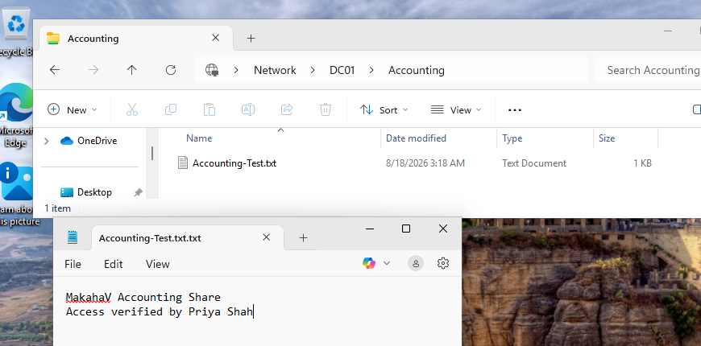

This proved both:

```text
Read access    -> SUCCESS
Modify access  -> SUCCESS
```

The positive and negative tests together demonstrate the intended authorization model:

```text
Alex Rivera
GG_IT
   |
   v
Accounting
DENIED


Priya Shah
GG_Accounting
   |
   v
Accounting
ALLOWED
```

This is a stronger validation than simply displaying an ACL configuration screen.

---

# 14. SMB Share Verification

The final server-side share configuration was verified using PowerShell:

```powershell
Get-SmbShare
```

The expected departmental shares were present:

```text
Accounting    C:\Shares\Accounting
IT            C:\Shares\IT
Sales         C:\Shares\Sales
```

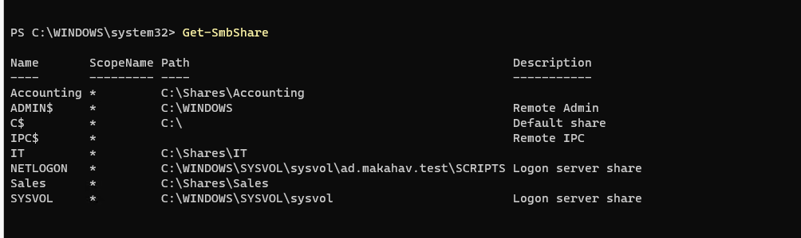

This verification step also identified two configuration issues during the project:

1. The Sales directory initially was not being published as expected.
2. The parent `C:\Shares` directory had accidentally been shared.

The Sales share was corrected and the unnecessary parent share was removed.

`Get-SmbShare` was then run again to verify the clean final configuration.

This was a useful example of why administrators should verify actual system state rather than assuming configuration steps produced the intended result.

---

# 15. Automated Department Drive Mapping

Users could manually access resources using UNC paths such as:

```text
\\DC01\Accounting
```

but expecting employees to remember network paths is not ideal.

A second GPO was therefore created:

```text
MakahaV - Department Drive Maps
```

This policy uses:

**Group Policy Preferences → Drive Maps**

to automatically provision departmental drives.

The mappings were configured as:

| Department | Group | Drive | Resource |
|---|---|---|---|
| Accounting | `GG_Accounting` | `A:` | `\\DC01\Accounting` |
| IT | `GG_IT` | `I:` | `\\DC01\IT` |
| Sales | `GG_Sales` | `S:` | `\\DC01\Sales` |

## Item-Level Targeting

The same GPO contains all three mappings.

However, **item-level targeting** determines which mapping an employee actually receives.

Conceptually:

```text
IF user is member of GG_Accounting
    map A: -> \\DC01\Accounting

IF user is member of GG_IT
    map I: -> \\DC01\IT

IF user is member of GG_Sales
    map S: -> \\DC01\Sales
```

The configuration was tested with multiple users.

Priya Shah received:

```text
Accounting (A:)
```

but not the IT or Sales drives.

Alex Rivera received:

```text
IT (I:)
```

but not Accounting or Sales.

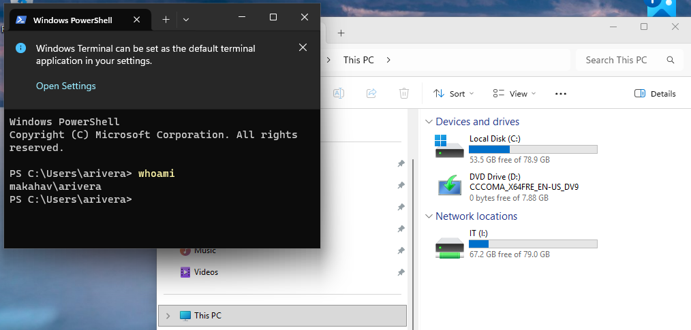

The screenshot demonstrates:

```text
whoami
makahav\arivera
```

alongside:

```text
IT (I:)
```

This verifies that Alex's domain identity automatically received the correct departmental resource based on security-group membership.

No manual drive mapping was required on CLIENT01.

---

# 16. Troubleshooting and Problem Solving

One of the most valuable parts of this project was troubleshooting issues rather than following a completely error-free deployment.

Several real problems occurred during the build.

## Active Directory DNS Resolution

Early DNS queries returned timeouts even though DC01 had the expected IP address.

Troubleshooting included:

- Checking IP configuration
- Verifying DNS server configuration
- Checking DNS services
- Flushing DNS caches
- Verifying the AD DNS zone
- Testing host records
- Testing Active Directory SRV records

This reinforced the dependency:

```text
Active Directory
       |
       v
      DNS
```

A domain client needs more than simple connectivity to the domain controller. It needs working DNS-based service discovery.

---

## Unexpected Host Power Loss

During the Windows 11 installation, the physical lab host unexpectedly lost power due to severe weather.

After power returned, the environment was inspected rather than immediately rebuilt.

Both virtual machines were checked in Hyper-V.

DC01 successfully returned to service and its domain/DNS functionality was validated before CLIENT01 installation continued.

This provided practical experience with:

- Recovering after an unplanned interruption
- Checking VM state
- Verifying infrastructure health before continuing
- Avoiding unnecessary rebuilds

---

## Windows 11 OOBE Networking

CLIENT01 initially could not proceed normally through Windows 11's network-dependent setup while attached to the isolated MakahaV-Lab network.

A temporary Hyper-V **Default Switch** connection was used to provide Internet connectivity during OOBE.

After installation:

```text
Default Switch
      |
      X
      |
MakahaV-Lab
```

CLIENT01 was moved back to the isolated lab network and configured with:

```text
10.10.10.20
```

and:

```text
DNS -> 10.10.10.10
```

This allowed Windows setup requirements to be satisfied without permanently changing the intended lab network design.

---

## Forgotten Domain User Password

The temporary password for one domain employee was forgotten before the first workstation login.

Rather than recreating the account, the password was reset through Active Directory Users and Computers.

This simulated a common help-desk workflow:

```text
User cannot authenticate
        |
        v
Identity verified
        |
        v
Password reset in AD
        |
        v
Temporary password issued
        |
        v
User changes password
```

---

## NTFS Inheritance

While configuring departmental folders, an attempt was made to remove generic Users permissions before inheritance had been disabled.

Windows prevented the removal because the permissions were inherited from the parent directory.

The solution was:

```text
Disable inheritance
        |
        v
Convert inherited permissions
to explicit permissions
        |
        v
Modify ACL safely
```

This provided practical experience with the difference between inherited and explicit NTFS permissions.

---

## Wrong Folder During Permission Configuration

At one point, permissions were being viewed on:

```text
C:\Shares
```

instead of:

```text
C:\Shares\Sales
```

The path displayed in Advanced Security Settings exposed the mistake before parent permissions were modified.

The configuration was canceled and reopened on the correct Sales directory.

This reinforced the importance of verifying the object being administered before changing an ACL.

---

## Missing Sales Share

After configuring the three departmental folders, PowerShell verification showed:

```text
Accounting
IT
```

but not:

```text
Sales
```

The Sales Advanced Sharing configuration was revisited and corrected.

Running:

```powershell
Get-SmbShare
```

again confirmed the share was now active.

---

## Accidental Parent Share

The same `Get-SmbShare` verification revealed another unintended share:

```text
Shares -> C:\Shares
```

The parent directory did not need to be exposed because employees should access their departmental shares individually.

The parent share was disabled.

A final verification showed only the intended departmental resources in addition to normal Windows administrative/domain shares.

This is a good example of a validation command uncovering a configuration issue that was not obvious from the GUI workflow.

---

# 17. Final Validation

The environment was not considered complete until both CLIENT01 and DC01 passed final validation.

## CLIENT01 Validation

Commands included:

```powershell
whoami
```

```powershell
ipconfig
```

```powershell
Resolve-DnsName dc01.ad.makahav.test
```

```powershell
nltest /dsgetdc:ad.makahav.test
```

```powershell
gpresult /r /scope computer
```

```powershell
auditpol /get /subcategory:"Logon"
```

These verified:

- Domain identity
- Client IPv4 configuration
- DNS resolution
- Domain controller discovery
- Group Policy application
- Security auditing

---

## DC01 Validation

Final server validation included:

```powershell
dcdiag /test:dns
```

```powershell
Get-ADDomainController
```

```powershell
Get-SmbShare
```

These verified:

- Domain controller health
- DNS functionality
- Active Directory domain controller information
- Departmental SMB shares

The final health checks completed successfully.

---

# 18. Security Principles Demonstrated

## Least Privilege

Employees receive only the access required for their department.

Example:

```text
IT Employee -> IT resources
Accounting Employee -> Accounting resources
Sales Employee -> Sales resources
```

An authenticated domain account does not automatically imply authorization to every network resource.

---

## Role-Based Access Control

Permissions are assigned to groups:

```text
GG_IT
GG_Accounting
GG_Sales
```

rather than individual employees.

Users receive access through membership in those groups.

---

## Centralized Identity Management

Employee accounts exist in Active Directory rather than independently on every workstation.

This enables centralized:

- Authentication
- Password administration
- Account lifecycle management
- Group membership
- Policy application

---

## Centralized Security Configuration

Group Policy allows workstation security settings to be managed from the domain rather than configured manually on each endpoint.

---

## Defense in Depth

Departmental file access uses multiple authorization layers:

```text
Active Directory Identity
        |
        v
Security Group
        |
        v
SMB Permission
        |
        v
NTFS Permission
```

---

## Auditing

Successful and failed logon events were enabled to provide visibility into authentication activity.

---

## Verification

Security controls were tested from the client rather than assumed to work.

Both:

```text
AUTHORIZED -> ALLOWED
```

and:

```text
UNAUTHORIZED -> DENIED
```

scenarios were validated.

---

# 19. Administrative Tools Used

The project provided hands-on experience with:

### Graphical Tools

- Hyper-V Manager
- Server Manager
- Active Directory Users and Computers
- DNS Manager
- Group Policy Management
- Group Policy Management Editor
- Windows File Explorer
- Advanced Security Settings
- Windows 11 network configuration
- Windows sign-in/domain authentication

### Command-Line / PowerShell Tools

```text
ipconfig
ping
Resolve-DnsName
Get-Service
Get-ADDomainController
Get-SmbShare
gpupdate
gpresult
auditpol
nltest
dcdiag
whoami
hostname
reg query
```

---

# 20. Skills Demonstrated

This project demonstrates practical experience with:

- Windows Server 2025
- Active Directory Domain Services
- Microsoft DNS
- Microsoft Hyper-V
- Windows 11 Pro
- Domain controller deployment
- Domain joins
- Domain authentication
- Organizational Unit design
- User account administration
- Password resets
- Security groups
- Role-based access control
- Group Policy Objects
- Group Policy Preferences
- Item-level targeting
- Security baselines
- Windows security auditing
- SMB
- NTFS permissions
- Share permissions
- Permission inheritance
- Least privilege
- Static IPv4 addressing
- DNS troubleshooting
- PowerShell
- Windows administrative tools
- Infrastructure validation
- Technical troubleshooting

---

# 21. Key Lessons Learned

## DNS Is Foundational to Active Directory

One of the strongest lessons from the project was that successful network connectivity does not necessarily mean Active Directory will work.

A client may be able to:

```text
ping 10.10.10.10
```

while still failing to locate:

```text
ad.makahav.test
```

if DNS is incorrectly configured.

Active Directory service discovery depends on DNS records such as LDAP SRV records.

---

## Configure, Then Verify

Throughout the project, configuration was followed by verification.

Examples:

```text
Configure GPO
    |
    v
gpupdate
    |
    v
gpresult
    |
    v
Registry verification
```

and:

```text
Create SMB shares
    |
    v
Get-SmbShare
    |
    v
Find configuration issue
    |
    v
Correct issue
    |
    v
Verify again
```

This proved more reliable than assuming that completing a GUI wizard meant the system was correctly configured.

---

## Groups Scale Better Than Individual Permissions

Assigning permissions directly to individual employees quickly becomes difficult to maintain.

Using:

```text
User -> Group -> Resource
```

provides a much more scalable authorization model.

---

## Negative Testing Matters

Testing only an authorized user proves that access works.

Testing an unauthorized user proves that the **security boundary works**.

The Accounting share tests demonstrated both sides.

---

## OU Design Has Operational Consequences

Organizational Units are not merely visual folders.

The placement of CLIENT01 inside:

```text
MakahaV\Computers
```

allowed workstation-specific Group Policy to be applied without targeting the domain controller.

Likewise, the Users hierarchy supported user-focused Group Policy such as departmental drive mapping.

---

# 22. Future Improvements

This lab intentionally uses a relatively small environment, but it provides a foundation for additional enterprise technologies.

Potential future improvements include:

- Deploying a second domain controller
- Configuring Active Directory replication
- Adding DHCP
- Moving file services to a dedicated member server
- Adding a dedicated data volume
- Implementing Windows LAPS
- Expanding the workstation security baseline
- Configuring Microsoft Defender policies
- Adding Windows Firewall policies
- Expanding Advanced Audit Policy
- Centralizing event logs
- Adding a SIEM platform
- Implementing automated user provisioning with PowerShell
- Adding backup and restore testing
- Creating Group Policy-based software deployment
- Adding additional Windows 11 clients
- Testing account lockout policies
- Implementing more granular file-server group design
- Creating administrative tiering/delegation

A larger version of the environment could evolve toward:

```text
                    Active Directory
                          |
             +------------+------------+
             |                         |
           DC01                       DC02
             |
       +-----+-----+
       |           |
   File Server    DHCP
       |
   Department
      Data
       |
 +-----+-----+
 |     |     |
PC01  PC02  PC03
       |
Centralized Logging / SIEM
```

---

# 23. Project Evidence

The complete screenshot set is stored in:

[`01-Screenshots`](./01-Screenshots/)

The evidence documents the project from initial infrastructure configuration through final security and automation testing.

| # | Evidence |
|---|---|
| 01 | DC01 static IPv4 configuration |
| 02 | Active Directory DNS SRV record verification |
| 03 | Active Directory OU structure |
| 04 | Domain user provisioning |
| 05 | Accounting security-group membership |
| 06 | Domain user authentication on CLIENT01 |
| 07 | Workstation Group Policy security baseline |
| 08 | Unauthorized Accounting-share access denied |
| 09 | Authorized Accounting-share read/write access |
| 10 | Departmental SMB share verification |
| 11 | Group-targeted departmental drive mapping |

---

# 24. Project Outcome

The final environment successfully demonstrated an end-to-end Windows domain implementation.

The completed workflow included:

```text
Hyper-V
   |
   v
Windows Server 2025
   |
   v
Active Directory + DNS
   |
   v
Users + Groups + OUs
   |
   v
Windows 11 Domain Join
   |
   v
Domain Authentication
   |
   v
Group Policy
   |
   v
Security Auditing
   |
   v
SMB + NTFS Access Control
   |
   v
Least-Privilege Testing
   |
   v
Group-Based Drive Mapping
   |
   v
Final Infrastructure Validation
```

The project moved beyond simply installing Windows Server by demonstrating how **identity, networking, DNS, policy, authorization, file services, and endpoint configuration interact in a Windows domain environment**.

Most importantly, major controls were validated from both the administrator and end-user perspectives.

---

## Resume Summary

**Windows Server 2025 Active Directory Enterprise Homelab**

Designed and deployed a virtualized Windows domain environment using Hyper-V, Windows Server 2025, and Windows 11 Pro. Configured Active Directory Domain Services, DNS, Organizational Units, domain users, security groups, domain-joined workstation authentication, Group Policy security controls, Windows auditing, SMB file sharing, NTFS/share permissions, least-privilege access controls, and security-group-targeted network drive mappings. Validated infrastructure using PowerShell and Windows diagnostic utilities including `Resolve-DnsName`, `gpresult`, `auditpol`, `nltest`, `dcdiag`, and `Get-SmbShare`.

---

## Author

Built as a hands-on cybersecurity and IT infrastructure portfolio project to develop practical experience with Microsoft enterprise administration, identity and access management, Windows networking, security controls, and troubleshooting.
